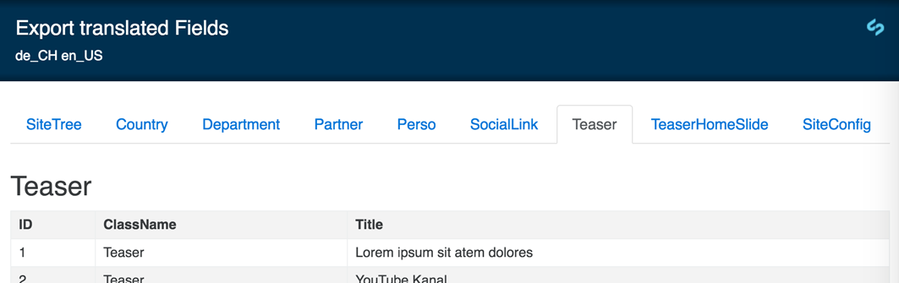

# Export SilverStripe Fluent translated Fields - work in progress
This module allows you to get Fluent translated Fields (from stage "live") as html-table

## Requirements
 * SilverStripe >3.2 <4, Fluent 

## Installation
Use [composer](https://getcomposer.org/)
```
composer require lerni/fluent-translated-fields
```
Since there is no stabe release yet you'll get the initial commit if you've set `"prefer-stable": true`. So you can get a certain (latest) commit with a specific hash. 
```
composer require lerni/fluent-translated-fields dev-master#6d61b9c620ecf99860be8f93d1615c3d03a381f9
```
?flush and you're set

## Usage
You must be loged in as Admin
Visit `http://yoursite/fluent-export`

## Screenshots


## ToDo:
- [ ] finish ToDos in FluentExportController
- [ ] LangSwitch
- [ ] CSV export
- [ ] Import
- [ ] Lang & JS translation